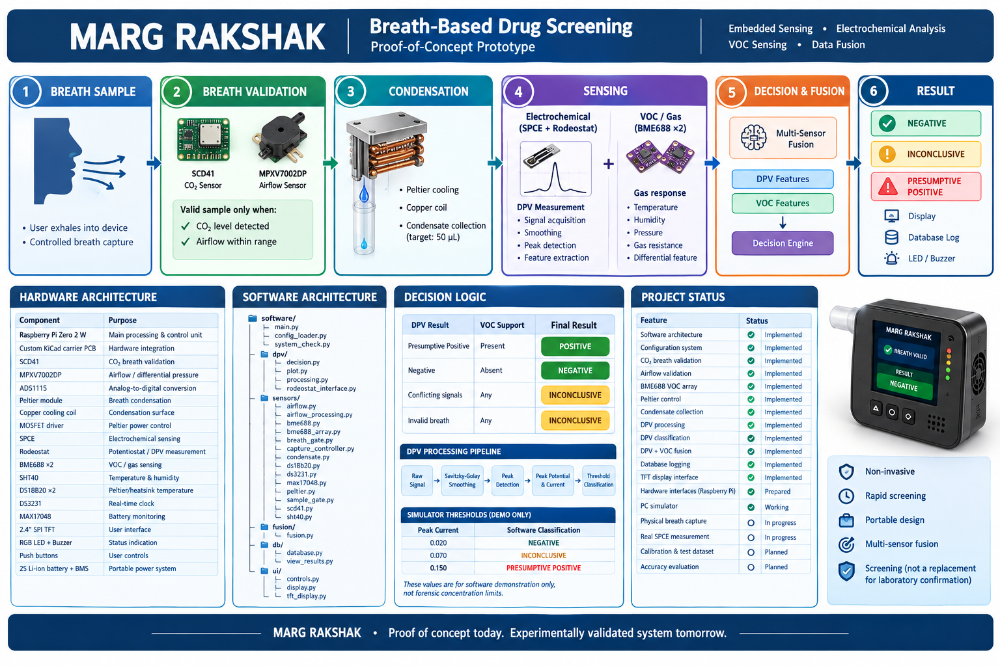

# MARG RAKSHAK
### Breath-Based Drug Screening — Proof-of-Concept Prototype


> **MARG RAKSHAK** is a portable, non-invasive breath-analysis proof-of-concept designed to demonstrate rapid field screening through breath-sample validation, condensate collection, electrochemical sensing, VOC sensing, signal processing, and multi-sensor decision fusion.

**Project Status:** Proof-of-Concept / Hardware Integration in Progress  
**Primary Platform:** Raspberry Pi Zero 2 W  
**Current Development Mode:** PC Simulator + Hardware-Ready Software Architecture

---

## 1. Problem Statement

Conventional drug screening methods such as urine and blood testing can require sample collection, laboratory equipment, trained personnel, and additional processing time.

MARG RAKSHAK explores a portable alternative based on **breath-sample analysis**, with the objective of providing rapid preliminary screening at the point of testing.

The system is designed as a **presumptive screening device**, not as a replacement for laboratory confirmation or forensic testing.

---

## 2. Proposed Solution

MARG RAKSHAK combines two complementary sensing approaches:

### 1. Electrochemical sensing
A **screen-printed carbon electrode (SPCE)** is used with a **Rodeostat potentiostat** to acquire electrochemical measurements from the collected breath condensate.

Differential Pulse Voltammetry (DPV) is used to obtain an electrochemical response curve.

### 2. VOC sensing
A pair of **BME688-based gas/VOC sensing channels** provides complementary gas-response information.

### 3. Multi-sensor fusion
Features extracted from the electrochemical and VOC channels are combined to improve the robustness of the screening decision.

The resulting output is categorized as:

- **NEGATIVE**
- **INCONCLUSIVE**
- **POSITIVE**

A positive result is intended as a **screening indication only** and should be followed by appropriate confirmatory laboratory testing.

---

# 3. System Workflow

```text
                    BREATH SAMPLE
                         │
                         ▼
              ┌─────────────────────┐
              │ Breath Validation   │
              │ CO₂ + Airflow       │
              └──────────┬──────────┘
                         │
                    Valid Sample
                         │
                         ▼
              ┌─────────────────────┐
              │ Peltier Condenser   │
              │ Breath Condensation │
              └──────────┬──────────┘
                         │
                    Condensate
                         │
             ┌───────────┴───────────┐
             ▼                       ▼
   ┌──────────────────┐    ┌──────────────────┐
   │ SPCE + Rodeostat │    │ BME688 VOC Array │
   │ Electrochemical  │    │ Gas Response     │
   │ DPV Measurement  │    │                  │
   └────────┬─────────┘    └────────┬─────────┘
            │                       │
            ▼                       ▼
   DPV Signal Processing      VOC Feature Extraction
            │                       │
            └───────────┬───────────┘
                        ▼
                 Sensor Fusion
                        │
                        ▼
              ┌─────────────────────┐
              │ Decision Engine     │
              └──────────┬──────────┘
                         │
             ┌───────────┼───────────┐
             ▼           ▼           ▼
          NEGATIVE  INCONCLUSIVE  PRESUMPTIVE
                                  POSITIVE
                         │
                         ▼
                Display + Database
```

---

# 4. Technical Approach

## 4.1 Breath Validation

The system first determines whether a usable breath sample has been provided.

Two measurements are used:

- **SCD41 CO₂ sensor** — identifies elevated CO₂ associated with exhaled breath.
- **MPXV7002DP differential-pressure sensor** — provides airflow information.

The sample is accepted only when the configured validation conditions are satisfied.

Invalid samples are not treated as negative results; they remain in a waiting/inconclusive state until a valid sample is obtained.

---

## 4.2 Breath Condensation

The proposed prototype uses a **Peltier-based cooling stage** to condense components of the breath aerosol into a small liquid sample.

The software controls:

- Peltier activation
- Configurable Peltier power
- Condensate target volume
- Capture state

The current software target is configurable and currently uses:

```text
Target condensate volume: 50 µL
Default Peltier power: 70%
```

The physical condensation efficiency will be characterized during hardware testing.

---

## 4.3 Electrochemical Sensing

The condensed sample is intended to be analyzed using a **screen-printed carbon electrode (SPCE)**.

The SPCE is connected to a **Rodeostat potentiostat**, which provides the electrochemical measurement interface.

The software acquires a current-versus-potential response using **Differential Pulse Voltammetry (DPV)**.

The current software pipeline performs:

1. Signal acquisition
2. Signal smoothing
3. Peak detection
4. Peak potential extraction
5. Peak current extraction
6. Threshold-based classification

The processing pipeline uses:

- NumPy
- SciPy
- scikit-learn
- joblib

---

## 4.4 DPV Signal Processing

The current implementation applies a Savitzky-Golay filter to reduce signal noise before peak detection.

The processing pipeline is:

```text
Raw DPV Signal
      │
      ▼
Savitzky-Golay Smoothing
      │
      ▼
Peak Detection
      │
      ▼
Peak Potential + Peak Current
      │
      ▼
Decision Thresholds
```

The proof-of-concept simulator currently demonstrates three signal classes:

| Simulated peak current | Software classification |
|---:|---|
| 0.020 | NEGATIVE |
| 0.070 | INCONCLUSIVE |
| 0.150 | PRESUMPTIVE POSITIVE |

These values are **software demonstration thresholds**, not forensic concentration limits.

---

# 5. VOC Sensing

Two BME688 channels are used as a complementary gas-response sensing array.

The current software extracts:

- Temperature
- Humidity
- Pressure
- Gas resistance

A differential gas-response feature is calculated between the two sensing channels.

The VOC channel is intended to complement the electrochemical measurement rather than independently establish a forensic identification.

---

# 6. Decision and Sensor Fusion

The system uses the electrochemical result and VOC response together.

Conceptually:

```text
                 DPV Result
                     │
                     │
                     ▼
               ┌───────────┐
               │           │
               │  Fusion   │◄──── VOC Response
               │           │
               └─────┬─────┘
                     │
                     ▼
                  RESULT
```

Current proof-of-concept decision behavior:

| DPV | VOC support | Final result |
|---|---|---|
| Presumptive Positive | Present | POSITIVE |
| Negative | Absent | NEGATIVE |
| Conflicting signals | Any | INCONCLUSIVE |
| Invalid breath | Any | INCONCLUSIVE |

The architecture is designed so that the fusion/decision layer can later be replaced or extended with a trained classifier once experimentally measured datasets become available.

---

# 7. Hardware Architecture

| Component | Purpose |
|---|---|
| Raspberry Pi Zero 2 W | Main processing and control unit |
| Custom KiCad carrier PCB | Hardware integration |
| SCD41 | CO₂-based breath validation |
| MPXV7002DP | Airflow / differential-pressure measurement |
| ADS1115 | Analog-to-digital conversion |
| Peltier module | Breath condensation |
| Copper cooling coil | Condensation surface |
| MOSFET driver | Peltier power control |
| SPCE | Electrochemical sensing |
| Rodeostat | Potentiostat / DPV measurement |
| BME688 ×2 | VOC/gas-response sensing |
| SHT40 | Temperature and humidity monitoring |
| DS18B20 ×2 | Peltier/heatsink temperature monitoring |
| DS3231 | Real-time clock |
| MAX17048 | Battery monitoring |
| 2.4" SPI TFT | User interface |
| RGB LED | Status indication |
| Buzzer | Audible status indication |
| Push buttons | User controls |
| 2S Li-ion battery + BMS | Portable power system |

---

# 8. Software Architecture

The software is organized into modular components:

```text
software/
│
├── main.py
├── config_loader.py
├── system_check.py
│
├── dpv/
│   ├── decision.py
│   ├── plot.py
│   ├── processing.py
│   └── rodeostat_interface.py
│
├── sensors/
│   ├── airflow.py
│   ├── airflow_processing.py
│   ├── bme688.py
│   ├── bme688_array.py
│   ├── breath_gate.py
│   ├── capture_controller.py
│   ├── condensate.py
│   ├── ds18b20.py
│   ├── ds3231.py
│   ├── max17048.py
│   ├── peltier.py
│   ├── sample_gate.py
│   ├── scd41.py
│   └── sht40.py
│
├── fusion/
│   └── fusion.py
│
├── db/
│   ├── database.py
│   └── view_results.py
│
└── ui/
    ├── controls.py
    ├── display.py
    └── tft_display.py
```

---

# 9. Repository Structure

```text
MARG-RAKSHAK/
│
├── config/
│   └── device_config.json
│
├── data/
│   ├── demo/
│   ├── processed/
│   └── raw/
│
├── hardware/
│
├── notebooks/
│
├── software/
│   ├── dpv/
│   ├── fusion/
│   ├── sensors/
│   ├── db/
│   └── ui/
│
├── tests/
│   └── test_fusion.py
│
├── RESEARCH AND REFERENCES/
├── README.md
└── .gitignore
```

---

# 10. Current Prototype Status

The project is being developed as a proof-of-concept.

| Feature | Status |
|---|---|
| Modular software architecture | ✅ Implemented |
| Configuration system | ✅ Implemented |
| CO₂ breath validation interface | ✅ Implemented |
| Airflow validation interface | ✅ Implemented |
| BME688 VOC array interface | ✅ Implemented |
| Peltier control interface | ✅ Implemented |
| Condensate collection logic | ✅ Implemented |
| DPV processing | ✅ Implemented |
| DPV classification | ✅ Implemented |
| DPV + VOC fusion | ✅ Implemented |
| Database result logging | ✅ Implemented |
| TFT display software interface | ✅ Implemented |
| Control/indicator interface | ✅ Implemented |
| Raspberry Pi hardware interfaces | ✅ Prepared |
| Full PC simulator | ✅ Working |
| Physical breath capture | 🔄 Hardware integration |
| Real SPCE measurement | 🔄 Hardware integration |
| Experimental calibration | 🔄 Planned |
| Measured test dataset | 🔄 Planned |
| Experimental accuracy evaluation | 🔄 Planned |

---

# 11. Running the Proof-of-Concept Simulator

### Requirements

- Python 3.11+
- NumPy
- SciPy
- scikit-learn

Clone the repository:

```bash
git clone https://github.com/R1tze/MARG_RAKSHAK_CEC.git
cd MARG_RAKSHAK_CEC
```

Run the simulator:

```bash
python software/main.py
```

The simulator currently uses:

```json
{
    "hardware": {
        "platform": "Raspberry Pi Zero 2 W",
        "mode": "simulator"
    }
}
```

This allows development and demonstration without requiring the physical Raspberry Pi or sensor hardware.

---

# 12. Example Demonstration Output

A successful simulator run currently produces output similar to:

```text
========================================
          MARG RAKSHAK
========================================
BREATH : VALID
SAMPLE : READY
DPV PEAK : 0.250 V
CURRENT  : 0.1469
DPV DECISION : PRESUMPTIVE POSITIVE

RESULT
----------------------------------------
POSITIVE
========================================

DPV peak potential: 0.250 V
DPV peak current: 0.1469
DPV decision: PRESUMPTIVE POSITIVE
Final result: POSITIVE
Result saved to database.
Peltier: OFF
---------------------------------
```

This demonstrates the complete software pipeline:

```text
Breath validation
       ↓
Sample ready
       ↓
DPV acquisition
       ↓
Signal processing
       ↓
DPV classification
       ↓
VOC + DPV fusion
       ↓
Final result
       ↓
Database logging
```

---

# 13. Test Dataset and Accuracy

The current repository contains a **proof-of-concept simulator**, and its generated DPV signals are synthetic.

Therefore, simulator output should **not be presented as measured drug-detection accuracy**.

The next validation stage is to build a controlled test dataset containing known reference classes and experimentally acquired sensor measurements.

The intended evaluation will include:

- Number of test samples
- Expected/reference class
- DPV features
- VOC features
- Predicted class
- Correct/incorrect classification
- Accuracy
- Precision
- Recall
- Confusion matrix

Accuracy will be calculated as:

```text
Accuracy =
Correct Predictions
------------------- × 100
Total Predictions
```

Any accuracy reported from a future experimental dataset will be clearly identified by its dataset size, test protocol, and limitations.

> **Important:** The current simulator demonstrates software functionality and decision logic. It does not establish clinical, forensic, or field accuracy.

---

# 14. Proof-of-Concept Scope

MARG RAKSHAK is intentionally being developed as a **technical feasibility prototype**.

The objective is to demonstrate that:

1. A breath sample can be validated.
2. Breath-derived condensate can be collected.
3. An electrochemical sensing workflow can be integrated.
4. DPV signals can be processed computationally.
5. VOC sensing can provide a complementary signal.
6. Multiple sensing channels can be fused.
7. A screening result can be generated and logged.

The project is **not intended to provide forensic confirmation or replace laboratory testing**.

---

# 15. Limitations

The current proof-of-concept has several limitations:

- The current PC demonstration uses simulated sensor data.
- Real SPCE measurements require experimental calibration.
- The physical condensation system requires characterization of collection efficiency.
- Sensor-to-sensor variation requires calibration.
- Environmental factors such as humidity and temperature can affect VOC measurements.
- Experimental datasets are required to train and validate a reliable classifier.
- Detection limits and quantitative concentration relationships must be experimentally established.
- A positive screening result should not be interpreted as definitive forensic identification.

---

# 16. Future Work

### Hardware

- Complete Raspberry Pi Zero 2 W integration.
- Integrate the custom carrier PCB.
- Characterize the Peltier condensation stage.
- Integrate the physical SPCE/Rodeostat measurement path.
- Calibrate airflow and breath-volume measurements.
- Integrate the TFT user interface.

### Software

- Expand hardware error handling.
- Add experimental calibration routines.
- Add data acquisition and dataset management.
- Train and validate ML models using experimentally collected data.
- Improve result visualization.
- Add automated system-health checks.

### Validation

- Establish controlled reference samples.
- Measure repeatability.
- Characterize sensor drift.
- Evaluate false-positive and false-negative behavior.
- Determine experimentally supported detection limits.
- Evaluate the system on an independent test set.

---

# 17. Safety and Interpretation

MARG RAKSHAK is a **screening proof-of-concept**.

Its output should be interpreted as:

> **NEGATIVE / INCONCLUSIVE / PRESUMPTIVE POSITIVE**

and not as a definitive forensic or medical diagnosis.

Any real-world deployment would require extensive analytical validation, controlled testing, appropriate regulatory review, and confirmation using established laboratory methods.

---

# 18. References

1. Karlovits, I. et al. **Comparison of Cyclic Voltammetry Measurements of Paper-Based Screen-Printed Electrodes via Proprietary and Open-Source Potentiostats.** *BioResources*, 16(2), 3916–3933, 2021.

2. Bosch Sensortec — BME688 documentation.

3. Sensirion — SCD4x CO₂ sensor documentation.

4. Sensirion — SHT4x temperature and humidity sensor documentation.

5. IO Rodeo — Rodeostat potentiostat documentation.

Additional references and research material are maintained in the repository's **RESEARCH AND REFERENCES** directory.

---

# 19. Project Goal

The long-term goal of MARG RAKSHAK is to demonstrate a compact, portable and rapid breath-analysis platform capable of providing **preliminary point-of-test screening** while reducing dependence on immediate laboratory infrastructure.

The current prototype focuses on demonstrating the underlying sensing architecture, embedded integration, signal processing and multi-sensor decision pipeline.

---

## MARG RAKSHAK

**Breath-Based Screening • Embedded Sensing • Electrochemical Analysis • VOC Sensing • Data Fusion**

> **Proof of concept today. Experimentally validated system tomorrow.**
